# Aspera Enterprise WebApps (AEW) - Quick Demo GUide

## Introduction

IBM Aspera® Enterprise WebApps is a modern web application that combines high-speed file collaboration and data delivery into a single unified platform.

### Key Highlights
- Consolidates core Aspera capabilities previously spread across multiple applications (such as Faspex, Shares and Cosole)
- Enables secure sharing and distribution of large datasets
- Simplifies data management workflows
- Supports on-premises, cloud, and hybrid environments
- Improves efficiency for teams handling large-scale data transfers

## Objective
This guide provides a simple and quick demonstration of the core functionalities of AEW. It is intended to help users quickly understand and experience the key features and workflows of the software.

For more detailed configuration, administration, and advanced usage information, please refer to the official Administration Guide and product documentation.

## References
1. [AEW User GUide](https://www.ibm.com/docs/en/aspera-webapps?topic=user)
2. [AEW Admin Guide](https://www.ibm.com/docs/en/aspera-webapps?topic=admin)
3. [IBM Aspera for Desktop Client Guide](https://www.ibm.com/docs/en/aspera-for-desktop/1.0.x?topic=getting-started)
4. [IBM Aspera Gided Demo](https://www.ibm.com/products/aspera/demo)

## Pre-requisites

1. You need to have AEW and HSTS deployed. Installation of these components are beyond the context of this document.    
2. You need to have at-least user-level access to AEW. 
3. You need to have the IBM Aspera for Desktop client application installed in your local computer to perform high speed FASP transfers. You can download and install the client from [here](https://ibmaspera.com/help/downloads/desktop).   

## Demo Guide
1. [Navigating the portal](#navigating-the-portal)
2. [Files App - Create Folder and Upload File](#b-files-app---create-folder-and-upload-file)
3. [Files App - Creating Link and Sharing it](#c-files-app---creating-link-and-sharing-it)
4. [Packages App - Send and Receive Files and Folders](#d-packages-app---send-and-receive-files-and-folders)
5. [Packages App - Ask others to send a package to a Shared Inbox](#e-packages-app---request-a-package-to-be-sent-to-a-shared-inbox)
6. [Activity App - Monitoring Bandwidth Usage](#f-activity-app---monitoring-bandwidth-usage)
7. [Activity App - Monitoring Transfer Volume Usage](#g-activity-app---monitoring-transfer-volume-usage)
8. [Automation App - Create a Simple Workflow](#h-automation-app---create-a-simple-workflow)

### A) Navigating the portal. 
1. Login to the AEW using the username and password provided or IBMID.  You should be in your home folder page. Navigate through the screen and understand the terms.    

 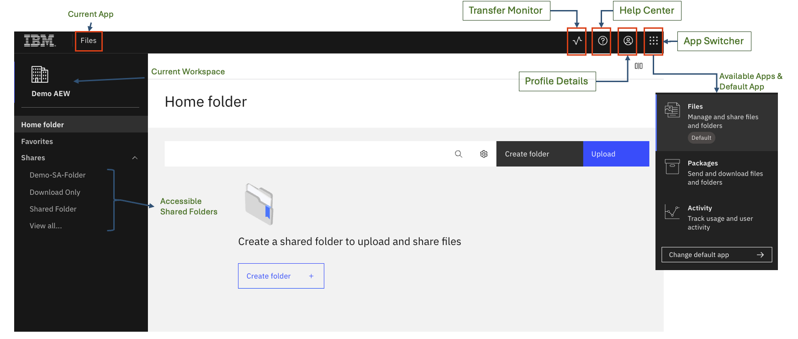
  

[More on Packages App](https://www.ibm.com/docs/en/aspera-webapps?topic=folders-packages-app-basics).  
[More on Files App](https://www.ibm.com/docs/en/aspera-webapps?topic=repository-files-app-basics).  
[More on Activity App](https://www.ibm.com/docs/en/aspera-webapps?topic=aameauiyo-overview).  
[More on Automation App](https://www.ibm.com/docs/en/aspera-webapps?topic=workflows-get-started).  
[What is a Workspace?](https://www.ibm.com/docs/en/aspera-webapps?topic=workspaces-what-is-workspace)

### B) Files App - Create Folder and Upload File.  
1. Login to AEW. You should see your home folder page. 
2. Create a folder.   

 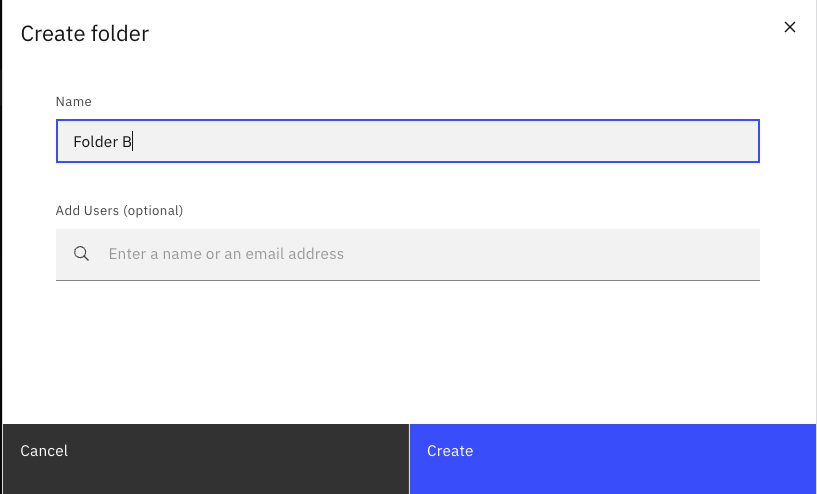
     

3. Navigate to the newly created folder.   
4. Upload a file. If IBM for Aspera Desktop is not launched automatically, click on the banner at the bottom of the screen and launch it.   

 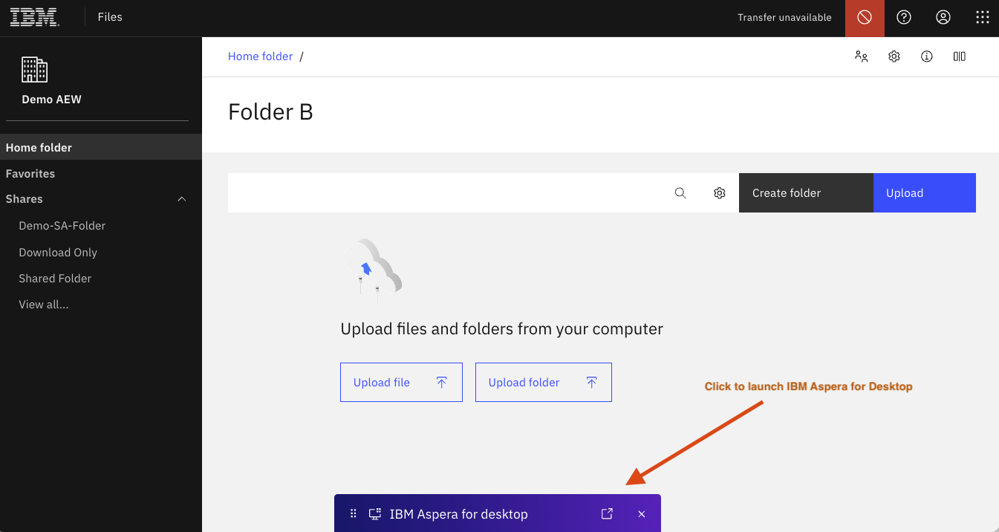
     

    The IBM for Aspera Desktop should start. Minimize it and get back to the browser.    

5. Click on 'Upload File' and pick a local file to upload.   
6. The upload should begin.  
7. Click on the "Transfer Monitor" icon to view the transfer progress.  

 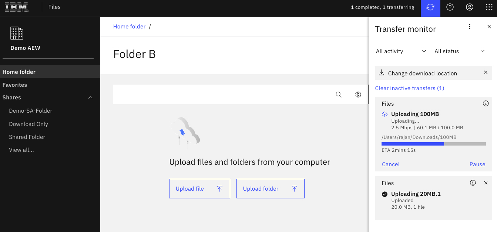
  

### C) Files App - Creating Link and Sharing it.
1. Login to AEW. Go to your home folder. You should see the folder you created in the previous step. 
2. Right Click on the folder that you have created and click on "Share Link".   
3. You will have a choice to create either a private link (access to limited people) or a public link (anyone with the link can access). For now, create a public link. 
4. Enter an expiry date for the link. Click Save. A new public link will be created. It will have a default access mode of edit - i.e. people with the link will be able to upload / delete / download files. To change this - click on the edit button ( the  'pen' icon).   

 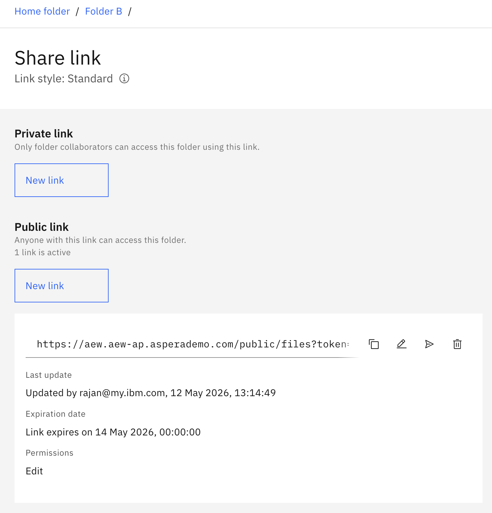
  

5. Copy the link created and send it to another person or open it in a private / incognito window. You should be able to see the folder and the contents of the folder. You will not be able to see any other shared folders. You will also have upload / delete access. 

 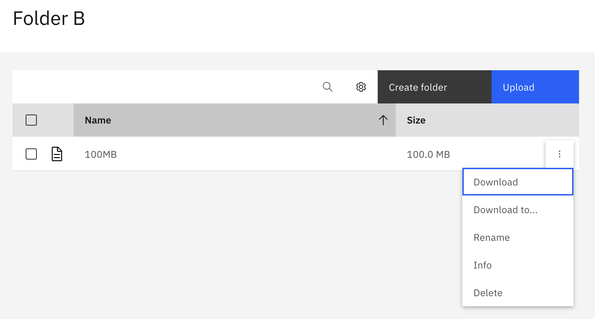
 

6. Now try editing the link and changing the permission to 'Download'. Open the link in a new private window. You will not have upload or delete access anymore. 

 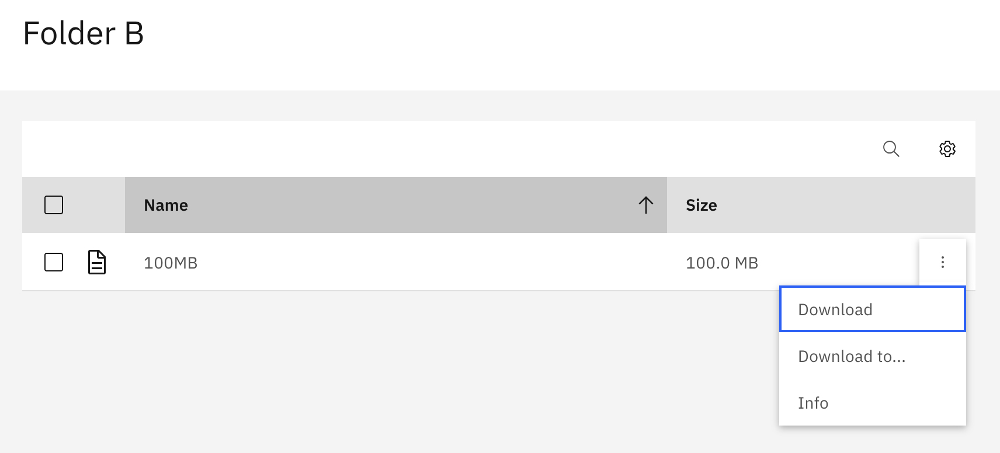
 

7. Next try editing the link again and turn on 'Password Protection'. Enter a password and Save. Open the link in a new private window. This time - you will be prompted to provide the password to be able to open the link.   
*This password if for opening the link - Not to be confused with password for encrypting the file during transfer*.   

8. Now try creating a Private Link and see how is that different from a public link. 

### D) Packages App - Send and Receive Files and Folders.   
1. Login to AEW. Go to your home folder.   
2. Click on the 'App Switcher and choose the Packages App.   
3. Click on Send Files.   
4. Enter the following mandatory fields. Other fields are optional - but worth exploring.     
    >Recipient E-mail address.    
    >Title.  
    >Add file(s) / folder(s).  

 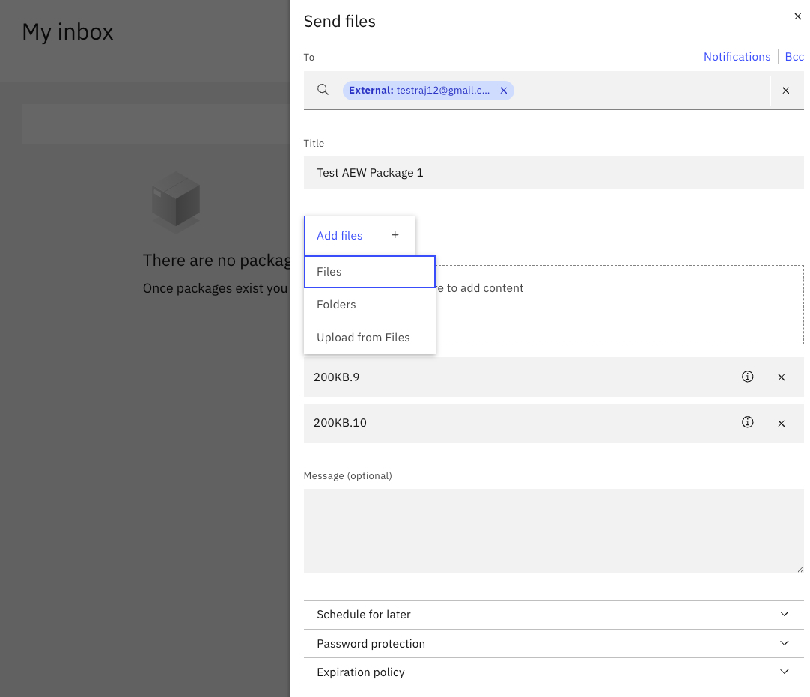

5. Click on Send. 
6. Click on the Transfer Monitor icon to monitor the transfer progress. 
7. Once the transfer is complete, the recipient will receive a notification with a link to browse and download the packages. The email will look similar to this.   

 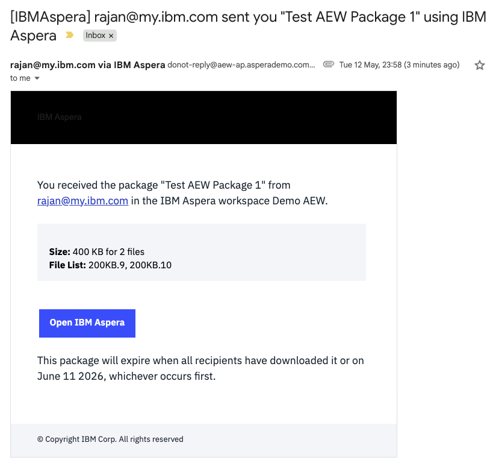
 

8. Click "Open IBM Aspera" in the email. It should take you to a page where you can view the list of files in the package and decide to download individual files or the entire package.   

 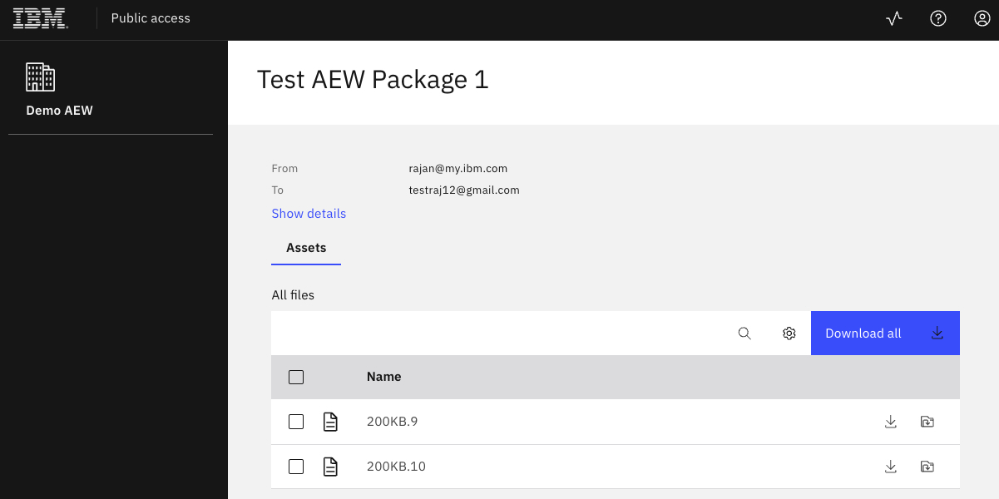
 

*You will not be asked to login because you are sending a package to a user who does not exist in the AEW database (unauthenticated user). However, if the user you are sending to exists in the AEW system, the user will be prompted to login first.*.  

**What are the options to send a package to multiple people?**   
You can enter multiple email addresses while sending a package. Apart from that, there are other options for sending packages to multiple people.   

[Shared Inbox - send content directly and simultaneously to all members of the shared inbox.](https://www.ibm.com/docs/en/aspera-webapps?topic=inboxes-what-is-shared-inbox).  
[Workspace Level Distribution List - Created by Admin](https://www.ibm.com/docs/en/aspera-webapps?topic=workspaces-create-workspace-distribution-lists).  
[Personal Distribution List](https://www.ibm.com/docs/en/aspera-webapps?topic=package-create-personal-distribution-list)

### E) Packages App - Ask others to send a package to a shared inbox.   
1. Login to AEW. Go to your home folder.   
2. Click on the 'App Switcher and choose the Packages App.   
3. Under the list of Inboxes, click on the shared inbox that you have access to.   

 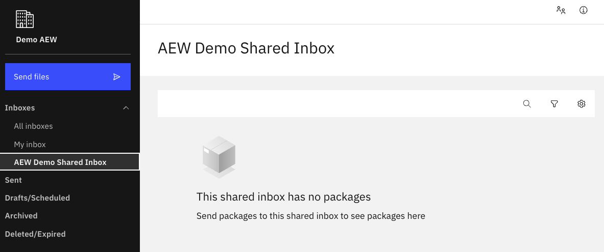
 

4. Click on members icon (top right) and then click on 'Manage Submission Link'.   

 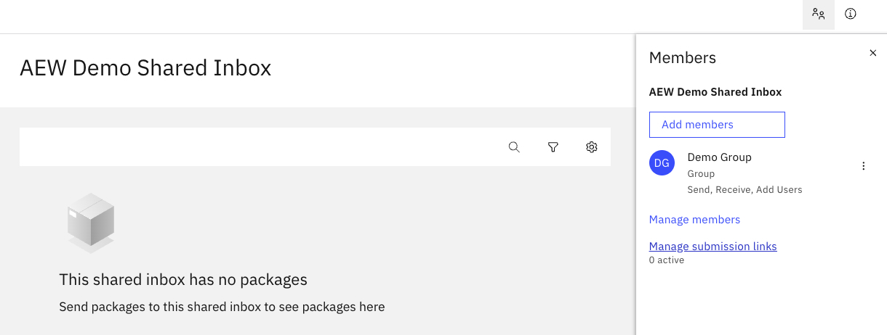
 

5. Create a new Public Link. 
6. Optionally edit the link and set an expiry date for the link.   

 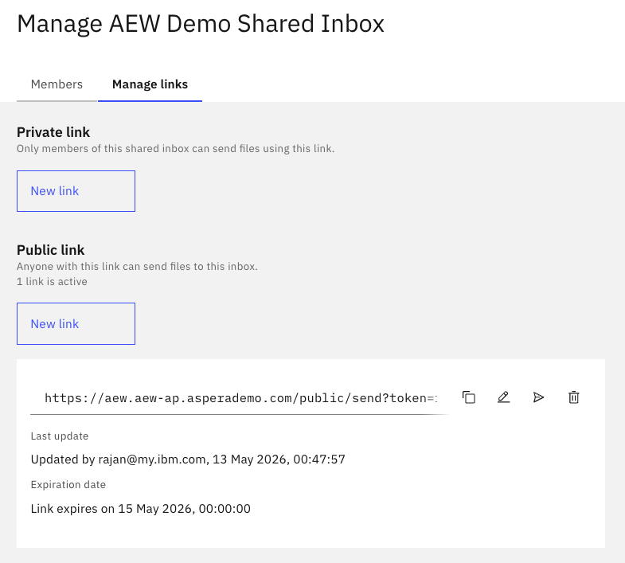
 

7. Copy the link and send it to another person or open it in a new private / incognito window. You should see a screen where you can create a package. Enter the following mandatory fields. Other fields are optional - but worth exploring.     
    >Sender Name.    
    >Sender Email Address.  
    >Title.  
    >Add file(s) / folder(s).  

 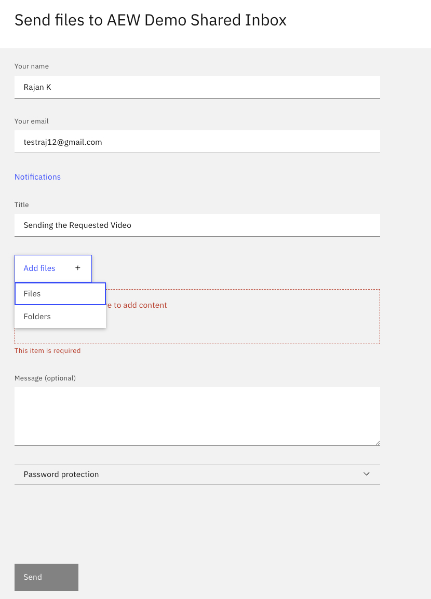
 

    Note that you will not be able to enter a recipient email as the recipient is the one who sent the link to you. 

8. Add some files and click Send. Your package should be created and delivered to the sender of the submission link.   
9. The sender of the submission link will be notified once the package has been stored in the Shared Inbox.   

 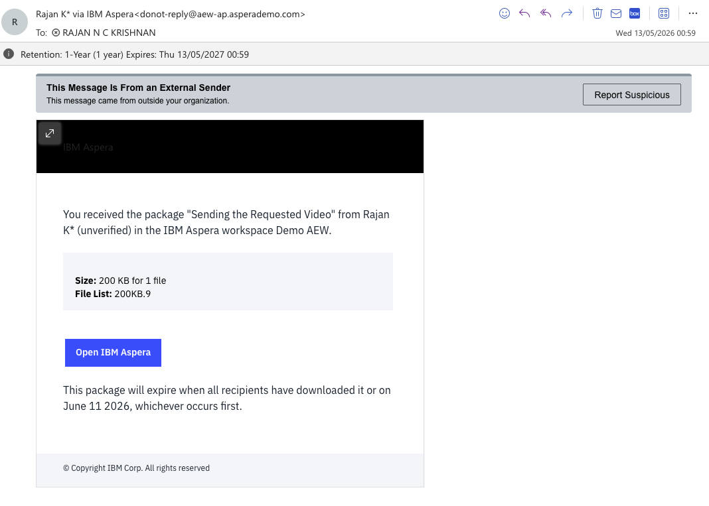
  
10. Open your packages app and click on the Shared Inbox. You should see the package sent to you listed there.  

 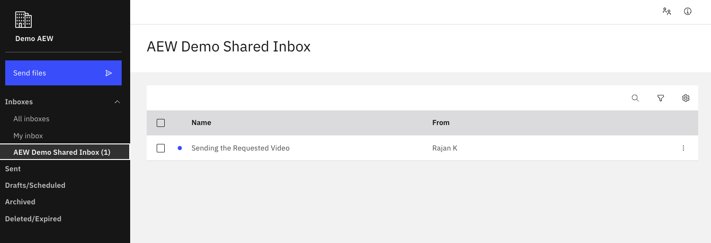
  

*It is possible to send a submission link to your personal packages inbox - rather than Shared Inbox. Click [here](https://www.ibm.com/docs/en/aspera-webapps?topic=folders-request-package-my-inbox) for more details*. 

### F) Activity App - Monitoring Bandwidth Usage.   
1. Login to AEW.  
2. Click on the 'App Switcher and choose the Activity App.   
3. Click on 'Transfer Activity'. 
4. You should be able to view all current transfers and the average performance of the system.   

 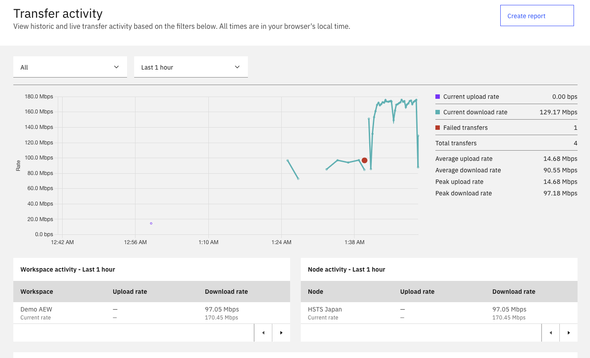
  

5. You can filter based on user, workspace, node. For example, to filter based on a specific user, Choose user and enter the username.   

 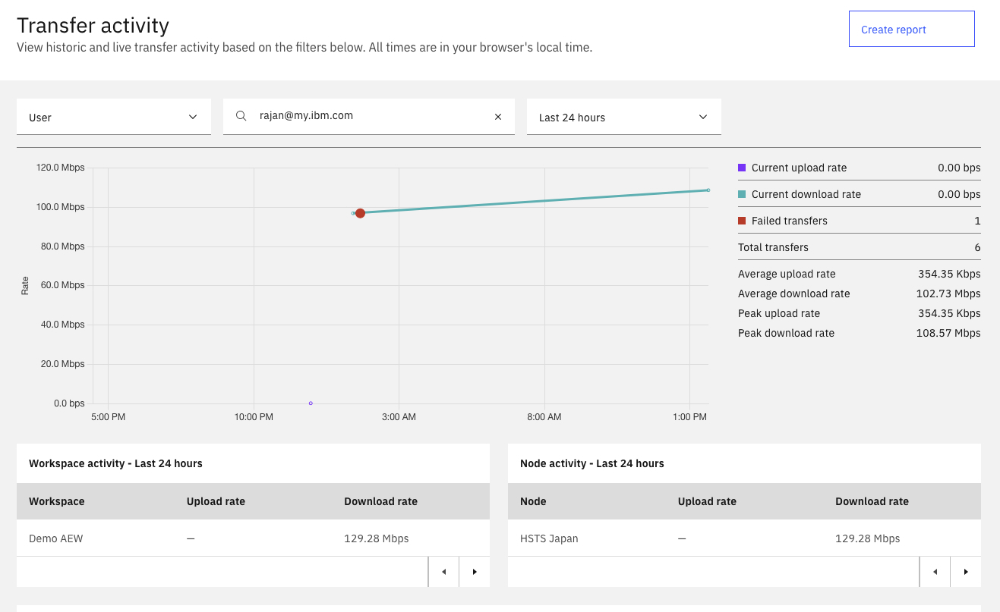
  

### G) Activity App - Monitoring Transfer Volume Usage.   
1. Login to AEW.  
2. Click on the 'App Switcher and choose the Activity App.   
3. Click on 'Volume Usage'. 

 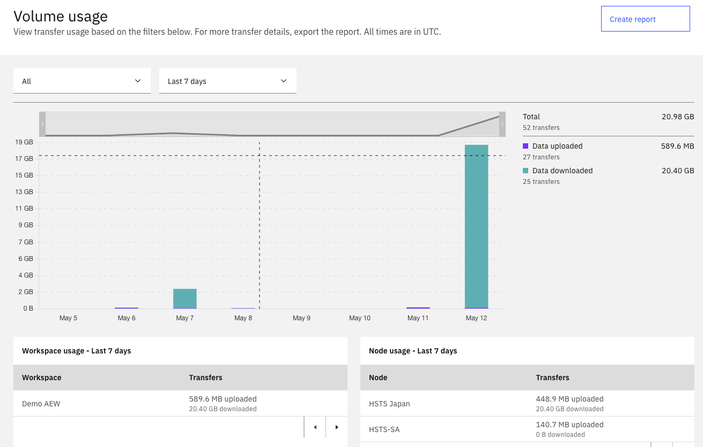
  

4. You can also filter by user.

 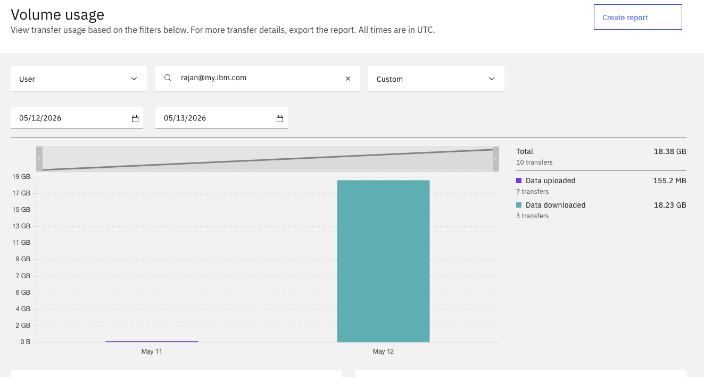
  

[What are the benefits of using the Activity App?](https://www.ibm.com/docs/en/aspera-webapps?topic=organization-use-cases).  
*You can also monitor audit events - such user created, file downloaded etc. from the 'Application Events' menu*.   

### H) Automation App - Create a Simple Workflow.   
We will create a workflow that will monitor your home folder. When a jpg file is uploaded to the home folder, the file will be sent as a package to an external recipient.    

1. Login to AEW.  
2. Click on the 'App Switcher and choose the Automation App.   
3. Click on "Create New". Enter a name for the workflow and click 'Submit'.   
4. Click on the "New Trigger" and Click on "File add Event".   

 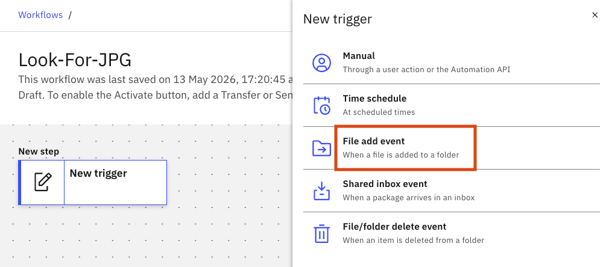
    

5. In the next screen choose the workspace name. Pick on the folders where you can upload files to and click "Select".   

 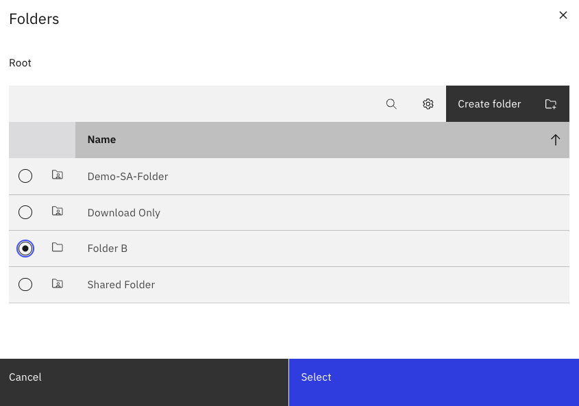
    

6. For the "Trigger When", click on 'Custom' and define a condition where the extension name contains 'jpg'.  Then click 'Save'.    

 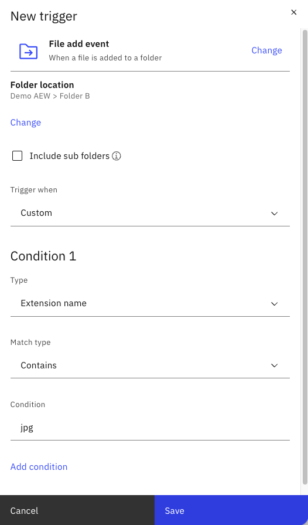
    

7. Click on the '+' next to Step 1 and Pick 'Send a Package'.  
8. Set the following. 
    >"Source of your Transfer" = "Same As Trigger".  
    >"After Transfer" = "Delete Source Content".  
    >"To(under Send Package)" = Enter Email address of a recipient.   
    >"Title" = Enter a title.   

The rest can be left default. Click on Save. 

 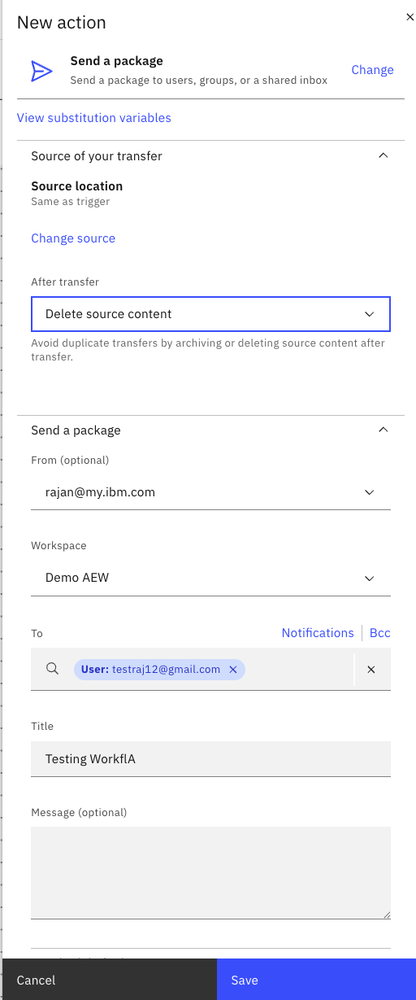
    

9. Thats it. You have created a simple workflow. Click on 'Activate' to activate the workflow. 
10. The workflow should be in active status. Click on the 'context menu' and choose 'Job Queue'. Entries will start appearing here when the flow runs.  

 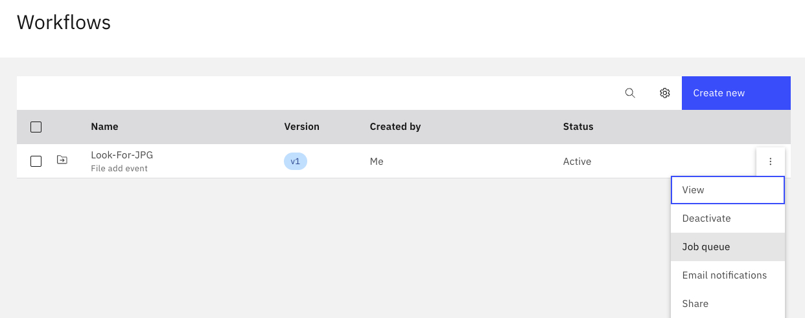
    

11. Now, from another tab, open AEW and switch to the Files App. Navigate to your home folder (the folder that you have configured to be monitored by the workflow).   
12. Upload a jpg file to this folder. Monitor / Check the following:

    You should see a job queue in Initiating State -> Running State -> Completed State. 
    
 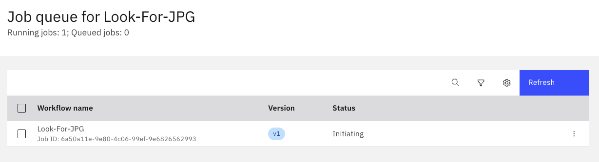
    

    Click on the job (completed) and you should be able to see the details of each step.   
    
 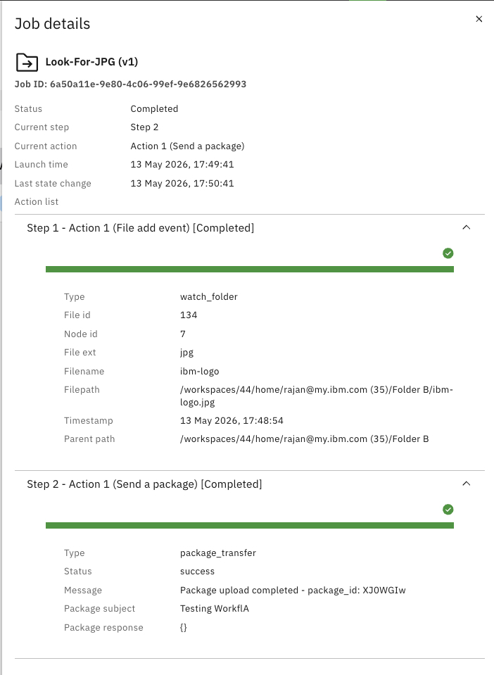
    

    Check for email notification in the recipient's email Inbox. You should receive a Package notification.   

    Check the source file that was uploaded. The file should have been deleted.   

## Summary
You are now able to do some basic demo with AEW. For more details refer to the user documentations listed in the References section.    
To understand AEW and its advanced configuration options in more depth - refer to the Admin Guide.    
